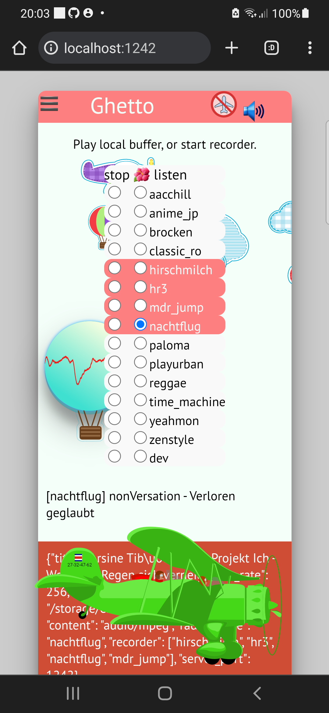
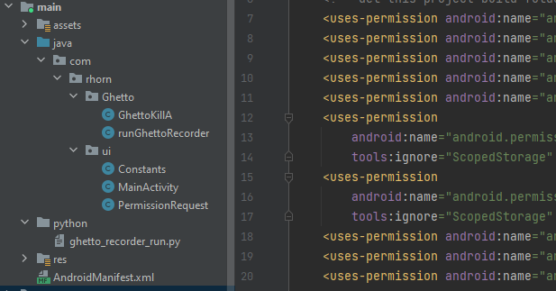

Ghetto-Android
##############

Grab multiple internet radio stations simultaneously.

Overview
--------

This repository shows the source code of the Python-Android package `[GhettoRecorder] <https://github.com/44xtc44/GhettoRecorder>`_.

The app uses Java to Python calls via Chaquopy plugin for Gradle. https://github.com/chaquo/chaquopy

All SVG images are created with Inkscape.
Airplane `SVG` and balloon `canvas` are animated with JavaScript's `requestAnimationFrame`.

|screenshot|  |studio|

|

Running the project
-------------------

Install the latest Android Studio.

Start a virtual device (AVD) and enable the preinstalled Browser with JavaScript enabled.

Option: Enable Notifications in the "Settings" app or menu.

How it works
------------

* `[MainActivity.java] <https://github.com/44xtc44/Ghetto-Android/blob/dev/app/src/main/java/com/rhorn/ui/MainActivity.java>`_ Start/Stop the ForeGroundService running GhettoRecorder. TextView informs the user.

* `[PermissionRequest.java] <https://github.com/44xtc44/Ghetto-Android/blob/dev/app/src/main/java/com/rhorn/ui/PermissionRequest.java>`_ Deal with the multi-access Permissions handling, for storage.

* `[runGhettoRecorder.java] <https://github.com/44xtc44/Ghetto-Android/blob/dev/app/src/main/java/com/rhorn/Ghetto/runGhettoRecorder.java>`_ Start the Python module in a `ForeGroundService`.

Limitations
-----------

This implementation of `[GhettoRecorder] <https://github.com/44xtc44/GhettoRecorder>`_ is not multiprocessor capable as multiprocessing is unsupported on Android.
Error message was `OSError: This platform lacks a functioning sem_open implementation, therefore,
the required synchronization primitives needed will not function, see issue 3770.`

We use Python queue.Queue() with Android OS.

The HTTP server produces one logcat error message for each started thread on a socket. Seems to be related to Chaquopy,
https://chaquo.com/chaquopy/doc/current/android.html

License
-------

MIT